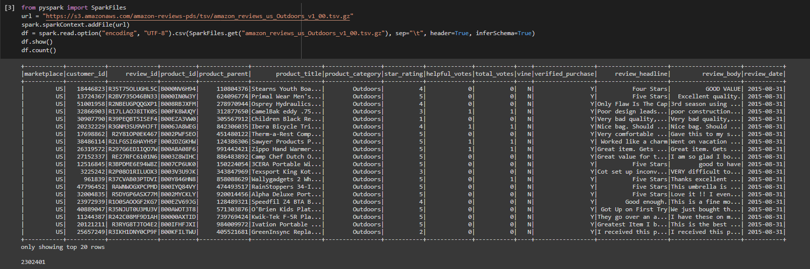

# Overview of the Analysis:

The purpose of this analysis was to learn what constitutes big data and how it is handled. The task led to analyzing Amazon reviews written by members of the paid Amazon Vine program. The goal was to determine if there was any bias in relation to favorable reviews from Vine members in the dataset.

A dataset containing Amazon reviews of a specific product (outdoors in this case) was provided. PySpark was used to perform the ETL process and to connect the data to an AWS RDS instance. After the data was transformed, it was loaded into pgAdmin. In order to analyze the data, we used the following resources:

Spark to handle large Datasets
Spark DataFrames and functions in Google Colab Notebooks
Cloud Databases with Amazon Web Services
Cloud Storage with S3 on AWS
PySpark to perform ETL
PostgreSQL

# Results:

Using the above resources, the product reviews were counted and grouped by star ratings. The analysis found the following:

First, we cleaned our table by taking out the unnecessary columns and counting the total rows.

As we can see the totals rows are 230,241. Then we added the filter to only get the totals votes for the products which were above 20% and counted the rows again.

As we can see, we have narrowed our analysis to 43,574 row. We then added another filter to get the Helpful votes for the products which were above 20% and it narrowed our result to 

39,976 rows.

To narrow the results and get an accurate analysis we added filter for the Paid & unpaid Vine on 5 start review. 

The total paid reviews are 107 and out of those the total 5-star paid reviews are 56 which means the percentage of the 5-star paid review is 52.34%.

The total unpaid reviews are 39,869 and out of those the total 5-star unpaid reviews are 21,005 which means the percentage of the 5-star unpaid review is 52.69%

# Summary:

The Analysis the shows there is a huge variance in the paid & unpaid reviews and unpaid reviews, percentage is slightly higher on the unpaid than review. Which means the products is good and people are using it and giving really good reviews about it. But then again, our analysis is based on the paid reviews for the verified purchased whereas the unpaid reviews are not based on the verified purchase. To get a more accurate results we should change our unpaid reviews to verified purchase.
